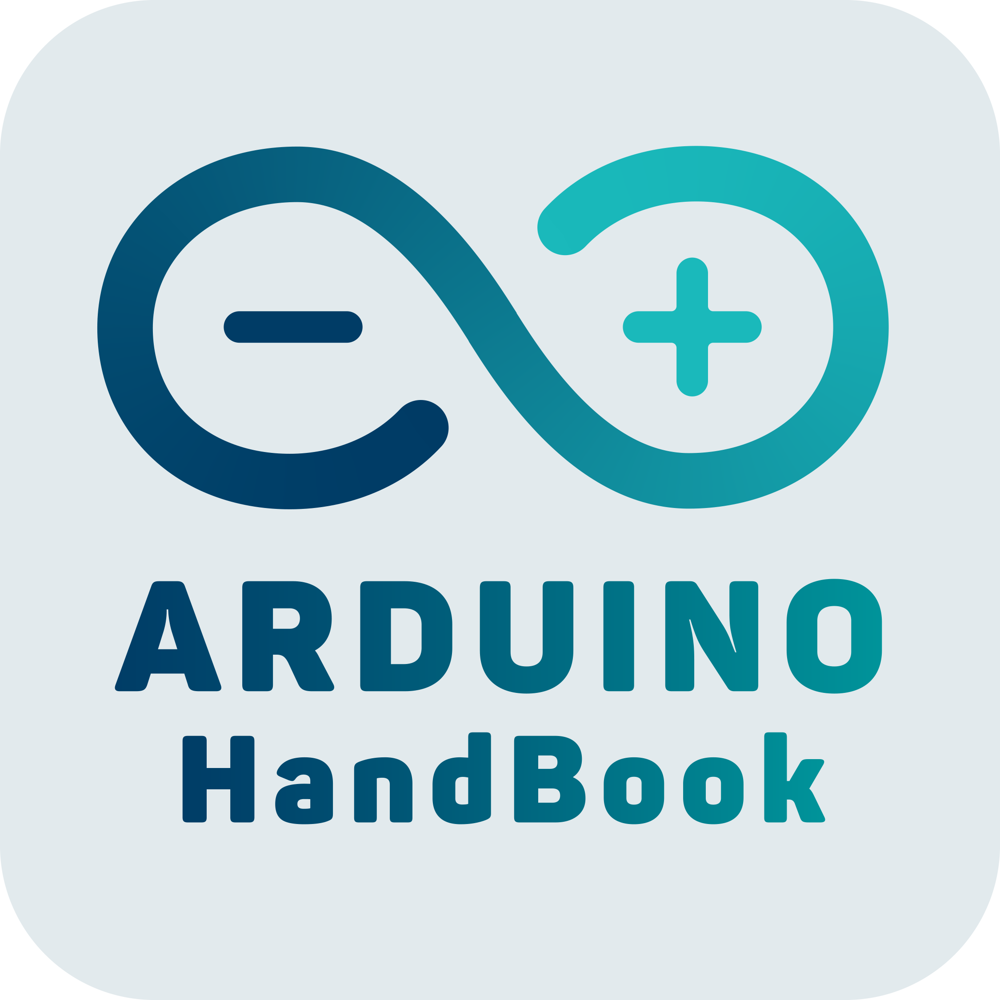

  

  
  <h1 align="center">Arduino HandBook</h3>
    Проект Arduino HandBook - помощник/справочник для разработчки на Arduino
  

<!-- TABLE OF CONTENTS -->

  
Содержание

  <ol>
    <li>
      <a href="#цель-проекта">Цель проекта</a>
    </li>
    <li>
      <a href="#особенности-нашего-решения">Особенности нашего решения</a>
    </li>
    <li><a href="#целевая-аудитория">Целевая аудитория</a></li>
    <li><a href="#участники-проекта">Участники проекта</a></li>
    <li><a href="install.md">Установка приложения</a></li>
  </ol>

# Цель проекта

Целью проекта является разработка мобильного приложения для устройств с *ОС Android*. Приложение представляет собой
справочник/шпаргалку/документацию по различным темам, связанными с разработкой на базе микроконтроллеров Arduino и
подобных им.

Создание данного приложения решает проблему с быстрым поиском необходимой информации среди начинающих и опытных
разработчиков/инженеров. Многие сталкиваются с трудностями запоминания базового синтаксиса языка *Arduino C*, а также
основных приемов схемотехники. Поиск уроков, статей на эту тему часто занимает большое кол-во времени. Поэтому,
реализация единой системы, где разработчики смогут быстро найти решение своей проблемы и поделиться опытом, является
целью нашего проекта.

# Особенности нашего решения

Аналоги данного приложения уже давно занимают свое место на различных маркетплейсах. Некоторыми из решений также служат
различные форумы, соц. сети, авторские сайты.

Проанализировав рынок аналогов, мы выявили каким должно быть наше приложение.

**Преимущества нашего решения:**

- доступ к данным по интернету (экономия места);
- интуитивно понятный интерфейс;
- современный дизайн с двумя темами оформления;
- начальный слайдер — помощник по приложению;
- адаптированный интерфейс под разные ориентации;
- полностью русскоязычный интерфейс;
- система личного кабинета;
- возможность создавать свои статьи и категории;
- продвинутый редактор статей (с текстом, картинками, видео, аудио);
- возможность оценивать чужие статьи;
- система лояльности, основанная на накоплении лайков;
- возможность добавлять статьи в закладки.

# Целевая аудитория

Аудиторией нашего приложения являются не только начинающие неопытные разработчики, но и уже профессионалы, которые
готовы делиться опытом, искать быстрые решения простых проблем. Такую шпаргалку многие пожелают держать при себе, ведь
это удобно. Приложение может понадобиться преподавателям цифровых образовательных центров: детям непросто запомнить
многие нюансы синтаксиса, а записи в блокнотах/тетрадях теряются и могут быть неточными.

# Участники проекта

## 😎 Суханов Артём Алексеевич

**TeamLeader**

Разработчик клиентской части, отвечает за дизайн, навигацию, основные функции, работу графического интерфейса.

**Email:** stakancheck@gmail.com

**Telegram:** @stakancheck

## ☝ Криштопа Денис Алексеевич

Разработчик серверной и клиентской частей, отвечает за отладку на разных устройствах, основные функции, написание кода.

**Загрузить приложение можно, скачав и установив файл apk из последнего релиза**

[Инструкция по установке](install.md)

Актуальный релиз доступен в разделе "Releases".

<!-- MARKDOWN LINKS & IMAGES -->
<!-- https://www.markdownguide.org/basic-syntax/#reference-style-links -->

[shield-version]: https://img.shields.io/github/v/tag/stakancheck/ArduinoHandbookVersion2

[shield-issues-closed]: https://img.shields.io/github/issues-closed/stakancheck/ArduinoHandbookVersion2

[shiled-apk-size]: https://img.shields.io/github/size/stakancheck/ArduinoHandbookVersion2/ArduinoHandbook.apk
