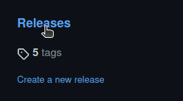
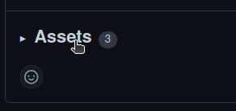
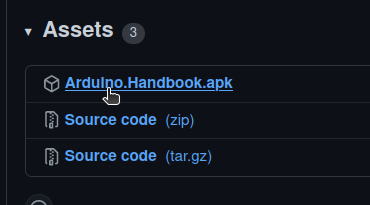
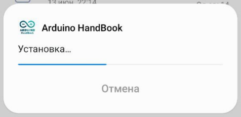

# Инструкция по установке последней версии приложения

<!-- TABLE OF CONTENTS -->

  
Содержание

  <ol>
    <li>
      <a href="#скачивание-apk-файла">Скачивание apk файла</a>
      <ul>
        <li><a href="#переход-к-релизам">Переход к релизам</a></li>
      </ul>
      <ul>
        <li><a href="#выбор-релиза">Выбор релиза</a></li>
      </ul>
      <ul>
        <li><a href="#загрузка-apk-файла">Загрузка apk файла</a></li>
      </ul>
    </li>
    <li>
      <a href="#установка-на-телефон-android">Установка на телефон (Android)</a>
    </li>
    <li>
      <a href="#системные-требования">Системные требования</a>
    </li>
  </ol>
    

    
# Скачивание apk файла

### Переход к релизам
Чтобы установить последний релиз приложение необходимо перейти в раздел "releases" из главной [страницы репозитория](https://github.com/stakancheck/ArduinoHandbookVersion2) или по ссылке на [страницу релизов](https://github.com/stakancheck/ArduinoHandbookVersion2/releases).

### Выбор релиза
Далее найдите поледний релиз по дате (он будет вверху). Нажмите на кнопку "Assets", чтобы открыть файлы. приложенные к релизу.

### Загрузка apk файла
Нажмите на самый первый файл с именем "ArduinoHandbook.apk", чтобы начать загрузку (на телефоне может потребоваться разрешение на скачивание).

**Актуальный релиз доступен [по ссылке](https://github.com/stakancheck/ArduinoHandbookApp/releases/).**

# Установка на телефон (Android)

Чтобы установить приложение на телефон откройте файл на своём устройстве и подтвержите установку (может потребоваться разрешение на установку из неизвестных источников).
Дождитесь окончания установки и запустите приложение.

**ВСЕ ГОТОВО!**

# Системные требования

OC: Android не ниже sdk v26 (Android 8.0)

Android System WebView не ниже версии 102 (на версии 83 и ниже проблемы с темной темой)

Другие параметры не являются строгими.

Память, занимаемая приложением, не превышает 35 MiB

Данные и Кэш могут достигать 5 MiB

Поддерживается темная тема и ландшафтная ориентация.
